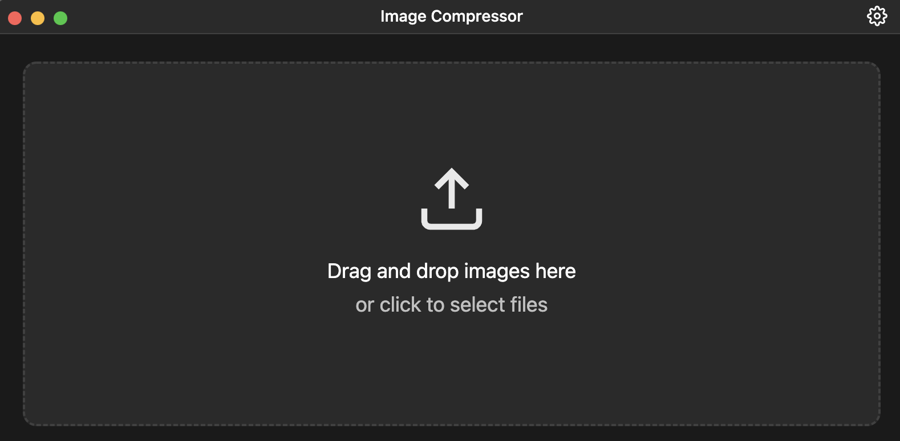

# Image Compressor

A desktop application built with Electron that allows you to compress images efficiently while maintaining quality. This tool helps reduce image file sizes for web usage, storage optimization, or sharing purposes.

## Downloads

Pre-built binaries are available for all major platforms. Download the latest version for your operating system:

### macOS
- Intel (x64): [Image Compressor-x64.dmg](../../releases/download/v1.0.0/Image.Compressor-x64.dmg)
- Apple Silicon (arm64): [Image Compressor-arm64.dmg](../../releases/download/v1.0.0/Image.Compressor-arm64.dmg)

### Windows
- Installer: [Image Compressor-Setup.exe](../../releases/download/v1.0.0/Image.Compressor-Setup.exe)
- Portable: [Image Compressor-portable.exe](../../releases/download/v1.0.0/Image.Compressor-portable.exe)

### Linux
- AppImage: [Image Compressor.AppImage](../../releases/download/v1.0.0/Image.Compressor.AppImage)
- Debian/Ubuntu: [image-compressor.deb](../../releases/download/v1.0.0/image-compressor.deb)

[View all releases](../../releases)

## Features

- Simple and intuitive user interface
- Drag and drop functionality for images
- Supports multiple image formats (PNG, JPG, JPEG)
- Adjustable compression settings
- Batch processing capability
- Dark mode/light mode/system mode
